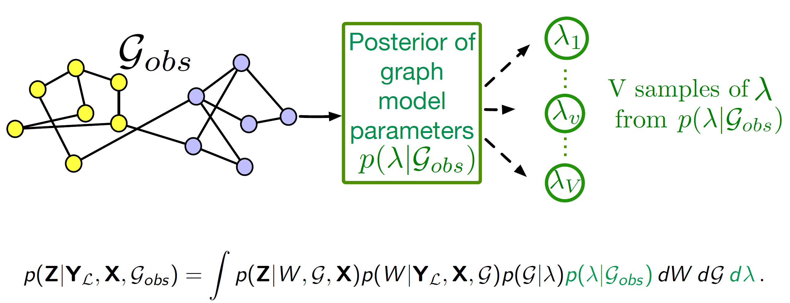
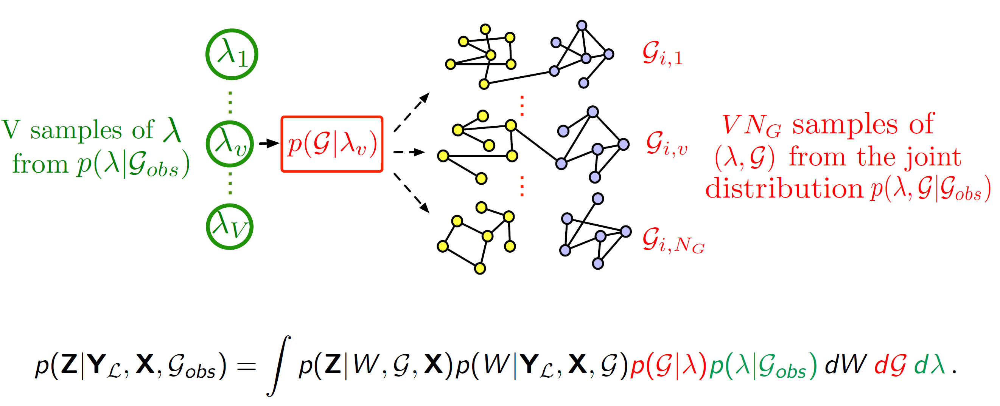
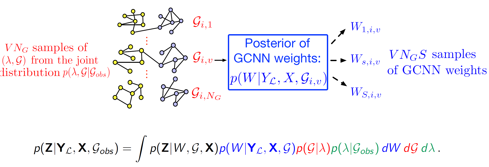
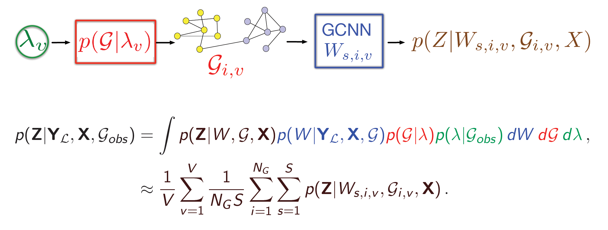

# BGCN

This is a TensorFlow implementation of "Bayesian Graph Convolutional Neural Networks" for the task of (semi-supervised) classification of nodes in a graph, as described in our paper:

Yingxue Zhang*, Soumyasundar Pal*, Mark Coates, Deniz Üstebay, [Bayesian graph convolutional neural networks for semi-supervised classification](https://arxiv.org/abs/1811.11103) (AAAI 2019)

## Getting Started
### Prerequisites
```
Python 3.5
sklearn
numpy
scipy
tensorflow (>=1.5.0)
```
### Run the demo
```
python BGCN_main.py
```

## Idea illustration
Almost all graph neural network based algorithms process a graph as though it is the ground-truth depiction of the relationship between nodes [2] [3], but often the graphs employed in applications are themselves derived from noisy data or modeling assumptions. Spurious edges may be included; other edges may be missing between nodes that have very strong relationships. Thus, the current GCNNs algorithms have the following limitations: (1) All the previous GCNN models are deterministic models and unable to capture the uncertainty of the underlying data topology.   (2) Overfitting problem happens when limited labels are presented for training.  (3) Sensitive to spurious links in the underlying structure.

<p align="center">

</p>

In this paper, we propose a novel graph convolution neural networks, namely the Bayesian graph convolutional neural networks (Bayesian-GCNNs) [1], to tackle the limitations of the previous GCNNs model as we addressed earlier. We use the node classification in semi-supervised learning setting as an example use case of the Bayesian-GCNNs. We will discuss the Bayesian-GCNNs formulation as follows.

Bayesian-GCNN views the observed graph as a realization from a parametric family of random graphs. We then target inference of the joint posterior of the random graph parameters and the node (or graph) labels using Bayes' theorem. We use a Monte Carlo approximation to achieve this process. In this approximation, three steps of sampling process are involved. First, V samples λv are drawn from the posterior of a family of graph generative model, as shown in Figure 2 (the precise method for generating these samples from the posterior varies depending on the nature of the graph model).  Secondly, the NG number of graphs are sampled from the graph generative model using the adopted random graph model, as shown in Figure 3. Thirdly, S weight matrices are sampled from the Bayesian GCNNs using the dropout approximation [4], as shown in Figure 4. The final prediction result is an average of all the predictions coming from different samples, as shown in Figure 5. Comparing to previous graph convolutional neural networks (GCNNs), the main difference is that when we do node label prediction, we will simultaneously learn a graph generation model based on the observed underlying topology, and we learn the parameters of this graph generation model. We can sample a number of similar distributions but diverse topology based on the posterior of the graph generation model. Thus, in the aggregation step of the GCNNs, we  are able to learn more general node embedding by incorporating information from different potential neighbors.

<p align="center">Figure 2 Step 1: Bayesian inference for a graph generative model<p align="center">

</p>

<p align="center">Figure 3 Step 2: Sampling random graphs<p align="center">

</p>

<p align="center">Figure 4 Step 3: Sampling GCNN weights<p align="center">

</p>

<p align="center">Figure 5 Step 4: Computing the posterior of the node labels<p align="center">

</p>

From various experiments, the Bayesian GCNN formulation shows that, although computationally more demanding,  it leads to (1) an ability to learn more rapidly  with less data, (2) a better capacity to represent uncertainty, and (3) better robustness and resilience to noise or adversarial attacks.

[1] Yingxue Zhang, Soumyasundar Pal, Mark Coates, Deniz Üstebay, "Bayesian graph convolutional neural networks for semi-supervised classification," in Proc. AAAI Conference on Artificial Intelligence (AAAI), 2019

[2] Thomas Kipf and Max Welling, "Semi-supervised classification with graph convolutional networks," in Proc. Int. Conf. Learning Representations (ICLR), 2017.

[3] William Hamilton, Rex Ying, and Jure Leskovec, "Inductive representation learning on large graphs," in Proc. Adv. Neural Inf. Proc. Systems (NIPS), 2017.

[4] Yarin Gal and Zoubin Ghahramani, "Dropout as a Bayesian approximation: Representing model uncertainty in deep learning," in Proc. Int .Conf. Machine Learning (ICML), 2016.

